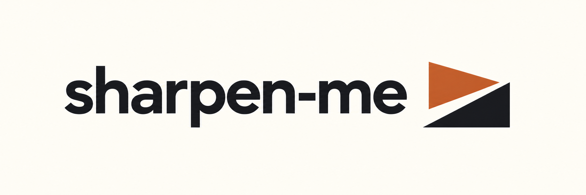

# sharpen-me

Codex와 Claude Code에서 요청을 구체화하고, 변경을 검토하고, 코드와 문서를 다듬는 8개 스킬입니다.

[](https://github.com/soom-kang/sharpen-me/actions/workflows/verify.yml)
[](../LICENSE)

[English](../README.md) · [사용법](usage.ko.md) · [GitHub Releases](https://github.com/soom-kang/sharpen-me/releases)

현재 릴리스는 [v0.9.0-beta.3](https://github.com/soom-kang/sharpen-me/releases/tag/v0.9.0-beta.3) GitHub Pre-release입니다. 문서와 설치 검증을 갱신했으며, 스킬 파일은 beta.2와 동일합니다.

## 전역 설치

Node.js 24.20.0 이상과 Git을 준비한 뒤 터미널에서 실행하세요.

```bash
npx skills add soom-kang/sharpen-me --global --skill '*' --agent codex claude-code
```

설치 확인 단계에서 내용을 확인하고 진행하세요. 이 명령은 현재 기본 브랜치의 스킬을 사용자 전역 범위에 설치합니다. 이후 변경을 받으려면 로컬 수정본을 보관한 뒤 같은 명령을 다시 실행하세요.

[사용법](usage.ko.md)에서 스킬 선택, 호출 예시, 업데이트와 제거 방법을 확인하세요.

## 평가 범위

beta.2의 선별 평가에서 후보 24개 슬롯이 모두 PASS였습니다. 이는 총 68회 호출의 유효한 결과를 모은 판정입니다. beta.3의 스킬 파일 24개는 beta.2와 같으며, 모델 평가를 새로 실행하지 않았습니다. 전체 576회 평가 게이트는 미통과 상태입니다. 기본 브랜치 설치를 특정 릴리스의 평가 결과와 동일시하지 마세요.

[평가 근거와 한계](evaluation.md) · [설계](design.md) · [유지보수](maintenance.md) (영문)

MIT. [라이선스](../LICENSE).
