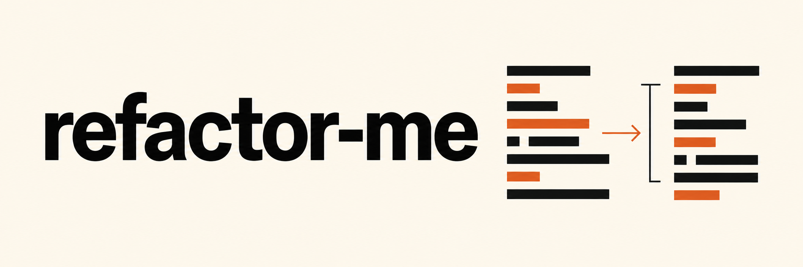

# refactor-me

Codex와 Claude Code에서 작업 계획, 코드 리뷰, 리팩토링에 사용하는 8개 Skill-set 입니다.

[](https://github.com/soom-kang/refactor-me/actions/workflows/verify.yml)
[](../LICENSE)

구현 전에 요구사항을 정리하거나 코드 변경을 검토할 때, 중복 코드를 공통 함수로 묶어도 될지 판단할 때 사용합니다. 필요한 skill을 골라 작업을 요청하세요. 각 skill은 정해진 절차에 따라 관련 파일과 근거를 확인하고 결과를 정리한 뒤 작업을 마칩니다.

**상태: 베타.**

[English](../README.md) · [설계](design.md) · [평가](evaluation.md) · [유지보수](maintenance.md)

## 설치

Node.js 24.20.0 이상이 필요합니다. Skill을 사용할 프로젝트에서 실행하세요.

```bash
npx skills add soom-kang/refactor-me
```

사용할 skill과 agent를 고르고 설치 범위는 **Project**를 선택하세요. 추가로 `find-skills` 전역 설치를 제안하면 거절해도 됩니다.

Codex와 Claude Code에 8개를 모두 설치하려면 다음 명령을 사용합니다.

```bash
npx skills add soom-kang/refactor-me --skill '*' --agent codex claude-code
```

두 agent에 `rm-review`만 설치하려면 다음 명령을 사용합니다.

```bash
npx skills add soom-kang/refactor-me --skill rm-review --agent codex claude-code
```

설치 가능한 목록과 현재 설치된 skill을 확인합니다.

```bash
npx skills add soom-kang/refactor-me --list
npx skills list --agent codex claude-code
```

Codex의 프로젝트 설치 경로는 `.agents/skills/`, Claude Code는 `.claude/skills/`입니다. 각 skill 폴더에 지침, metadata, 라이선스가 들어 있어 하나만 설치해도 사용할 수 있습니다. 프로젝트와 전역에 같은 skill이 있다면 agent가 어느 경로의 파일을 읽는지 확인하세요.

## Skill 목록

| Skill             | 사용 시점                                                       | 결과                                                                      |
| ----------------- | --------------------------------------------------------------- | ------------------------------------------------------------------------- |
| `rm-scope`        | 구현 전에 무엇을 만들지 명확히 정해야 할 때                     | 미해결 결정 또는 요청된 작업 범위 보고                                  |
| `rm-review`       | 코드 변경에서 버그나 호환성 문제를 찾을 때                      | 발견한 문제, 해당 코드와 확인 방법                                        |
| `rm-challenge`    | 계획대로 진행하기 전에 가정이 맞는지 확인할 때                  | 가정을 뒷받침하거나 반박하는 근거와 필요할 경우 이를 확인할 간단한 테스트 |
| `rm-assess`       | 작업의 위험도와 필요한 모델 역량·추론 수준을 판단할 때          | 변경 위험, 권장 모델 역량·추론 수준, 필요한 검증                          |
| `rm-refine`       | 정한 범위 안에서 기존 코드를 단순화하거나 기술 문서를 수정할 때 | 수정 내용과 검증 결과 또는 원본을 유지할 이유                             |
| `rm-review-fresh` | 작성자의 추론이 없는 별도 context에서 검토받고 싶을 때          | 문서 이해도·코드 정확성 검토 또는 격리 불가 사유                    |
| `rm-brief`        | 중단했던 작업을 다시 시작하거나 다른 사람에게 넘길 때           | 달라진 점, 미해결 사항, 다음에 할 일과 출처                               |
| `rm-dedup`        | 여러 곳에 반복된 코드를 하나로 묶어도 될지 확인할 때            | 중복 코드의 위치와 공통화하거나 따로 둘 부분. 수정은 요청한 경우에만 진행 |

## 호출 방법

메시지 앞에 skill 이름을 쓰고 원하는 작업을 요청하세요.

```text
Codex:       $rm-review 현재 diff에서 버그나 호환성 문제가 있는지 확인해줘.
Claude Code: /rm-review 현재 diff에서 버그나 호환성 문제가 있는지 확인해줘.
```

아래 예시는 Codex 문법입니다. Claude Code에서는 맨 앞의 `$`를 `/`로 바꿉니다. 각 예시를 별도 메시지로 보내고 경로나 commit은 실제 값으로 바꾸세요.

```text
$rm-scope API 계약을 읽고 담당자 필터를 추가할 작업 범위를 정해줘. 아직 구현하지 마.
$rm-challenge docs/retry-plan.md의 핵심 가정이 맞는지 확인해줘. 결과를 재현할 수 있는 로컬 테스트를 제안해줘.
$rm-assess 제안한 마이그레이션의 위험을 평가하고 필요한 모델 역량과 추론 수준을 추천해줘. 마이그레이션은 실행하지 마.
$rm-refine src/parser.ts의 입력, 출력, 오류 처리 동작을 유지하면서 구조를 단순화해줘. 이 파일만 수정해.
$rm-review-fresh 작성자의 추론이 없는 별도 context에서 docs/runbook.md를 검토해줘. 그런 환경이 없으면 검토를 실행할 수 없는 이유를 알려줘.
$rm-brief <known-commit> 이후 바뀐 내용, 더 결정해야 할 사항, 수행한 검증을 출처와 함께 정리해줘.
$rm-dedup src/import-a.ts와 src/import-b.ts의 정규화 코드를 비교해줘. 수정하지 말고 공통화할 부분과 따로 둘 부분을 제안해줘.
```

Agent가 요청에 맞는 skill을 자동으로 선택할 수도 있습니다. 수정할 파일과 결과 형식은 사용자의 요청을 따릅니다. Skill 선택만으로 수정 권한을 부여하거나 모델·provider 설정을 바꾸지는 않습니다. `rm-review-fresh`에는 작성자의 추론이 없는 별도 context가 필요합니다. 같은 대화를 계속하는 것만으로는 이 조건을 충족하지 못합니다. 자세한 내용은 [설계](design.md)를 참고하세요.

## 업데이트와 제거

업데이트하거나 다시 설치하기 전에 로컬에서 수정한 내용이 있는지 확인하세요. 현재 프로젝트의 `rm-review`를 업데이트하려면 다음 명령을 사용합니다.

```bash
npx skills update rm-review -p
```

현재 프로젝트에서 8개 skill을 모두 제거합니다.

```bash
npx skills remove rm-scope rm-review rm-challenge rm-assess \
  rm-refine rm-review-fresh rm-brief rm-dedup
```

`--agent` 없이 이름으로 제거하면 프로젝트의 공유 설치 경로와 agent별 경로에서 해당 skill을 제거합니다. 다른 skill과 전역에 설치한 파일은 유지합니다.

## 검증

이 저장소를 내려받은 폴더에서 실행합니다.

```bash
npm ci --ignore-scripts
npm run verify
npm run test:install
npm run eval -- --dry-run
```

위 명령으로 skill 패키징, 문서 링크, 평가 도구와 설치를 확인합니다. Dry run은 provider를 호출하지 않고 실행할 평가 목록을 보여 줍니다. Node.js 요구사항과 검사 범위는 [유지보수](maintenance.md#local-checks), 실제 평가의 실행 요건과 릴리스 기준은 [평가](evaluation.md)를 참고하세요.

## 라이선스

MIT입니다. 전문은 [LICENSE](../LICENSE)를 참고하세요. Skill을 하나만 설치해도 라이선스 파일이 함께 설치됩니다.
