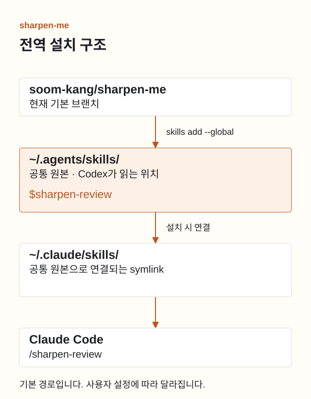
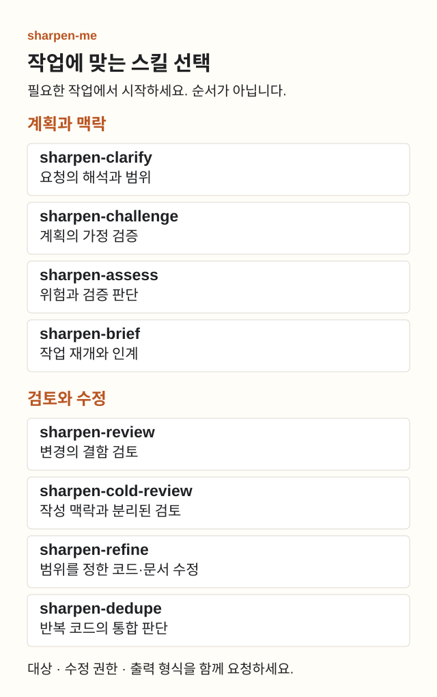

# sharpen-me 사용법

[English](usage.md) · [처음으로](README.ko.md)

설치한 스킬을 작업 목적에 맞게 하나 골라 호출하세요. 모든 스킬을 순서대로 실행할 필요는 없습니다.

## 1. 설치하고 확인하기

Node.js 24.20.0 이상, npm/npx, Git과 사용할 Codex 또는 Claude Code를 준비하세요. 저장소를 복제할 필요는 없습니다.

```bash
npx skills add soom-kang/sharpen-me --global --skill '*' --agent codex claude-code
npx skills list --global --agent codex claude-code
```

설치 확인 질문에 응답하세요. 선택 사항인 `find-skills` 설치는 거절해도 됩니다. 목록에 sharpen-me 스킬 8개가 표시되면 설치를 확인한 것입니다. 한 스킬만 설치하려면 다음을 실행하세요.

```bash
npx skills add soom-kang/sharpen-me --global \
  --skill sharpen-review --agent codex claude-code
```

위 명령은 현재 기본 브랜치를 설치합니다. 기본 브랜치는 릴리스 이후에도 변경될 수 있습니다. [v0.9.0-beta.3 Pre-release](https://github.com/soom-kang/sharpen-me/releases/tag/v0.9.0-beta.3)를 고정해서 설치하려면 tag URL을 사용하세요.

```bash
npx skills add https://github.com/soom-kang/sharpen-me/tree/v0.9.0-beta.3 \
  --global --skill '*' --agent codex claude-code
```

재설치 전에 로컬 스킬 수정본을 보관하세요. 같은 tag URL을 다시 실행하면 같은 릴리스를 설치합니다. 이후 변경을 받으려면 새 tag나 기본 브랜치를 선택하세요.



기본 symlink 방식은 `~/.agents/skills/`에 원본을 두고 Claude Code의 `~/.claude/skills/`에서 연결합니다. Codex는 공통 경로를 사용합니다. `CLAUDE_CONFIG_DIR`을 설정하면 Claude 경로가 달라집니다. 링크를 만들지 못하면 CLI가 복사 방식으로 전환할 수 있습니다.

## 2. 스킬 선택하기



| Skill | 선택 기준 |
| --- | --- |
| `sharpen-clarify` | 요청의 해석이 갈릴 때 |
| `sharpen-challenge` | 계획의 가정을 검증할 때 |
| `sharpen-assess` | 위험과 필요한 검증을 판단할 때 |
| `sharpen-brief` | 작업을 재개하거나 인계할 때 |
| `sharpen-review` | 변경의 결함을 찾을 때 |
| `sharpen-cold-review` | 작성 맥락과 분리해 검토할 때 |
| `sharpen-refine` | 코드나 문서를 범위 안에서 다듬을 때 |
| `sharpen-dedupe` | 반복 코드의 통합 여부를 판단할 때 |

`sharpen-review`는 일반 변경 검토에, `sharpen-cold-review`는 독립된 맥락이 필요한 검토에 사용하세요. `sharpen-cold-review`를 같은 대화에서 부르는 것만으로 독립성이 확보되지는 않습니다. 분리된 맥락을 만들 수 없으면 `not_run`을 보고해야 합니다.

## 3. 작업과 범위를 함께 요청하기

Codex에서는 `$이름`, Claude Code에서는 `/이름`으로 시작하세요. 아래 두 줄은 각각의 앱에 보내는 요청 예시이며 터미널 명령이 아닙니다.

```text
$sharpen-review 현재 diff에서 버그를 찾아줘. 파일은 수정하지 마.
```

```text
/sharpen-review 현재 diff에서 버그를 찾아줘. 파일은 수정하지 마.
```

대상 파일, 변경 허용 범위, 필요한 출력 형식을 적으세요. 아래 예시는 실제 경로나 커밋으로 바꿔 한 번에 하나씩 사용하세요. Claude Code에서는 첫 `$`를 `/`로 바꾸면 됩니다.

<details>
<summary>계획과 인계 예시</summary>

```text
$sharpen-clarify API 계약을 읽고 담당자 필터의 작업 범위를 정해줘. 해결되지 않은 선택만 질문하고 아직 구현하지 마.
$sharpen-challenge docs/retry-plan.md의 가정을 검토해줘. 가정이 맞는지 구분할 수 있는 테스트를 제안해줘.
$sharpen-assess 제안한 마이그레이션의 위험과 필요한 검증을 평가해줘. 모델 역량과 추론 수준을 추천하되 실행하지 마.
$sharpen-brief known_commit 이후 변경, 미해결 결정, 완료한 검증을 출처와 함께 정리해줘.
```

</details>

<details>
<summary>검토와 수정 예시</summary>

```text
$sharpen-cold-review 별도 맥락에서 신규 운영자 관점으로 docs/runbook.md를 검토해줘. 맥락을 분리할 수 없으면 not_run을 보고해줘.
$sharpen-refine src/parser.ts의 입력, 출력, 오류 동작을 유지하며 구조를 다듬어줘. 이 파일만 수정해.
$sharpen-dedupe src/import-a.ts와 src/import-b.ts를 비교해줘. 수정하지 말고 공통화할 부분과 따로 둘 부분을 제안해줘.
```

</details>

스킬 선택은 추가 권한을 부여하지 않습니다. 모델 설정과 수정 권한은 요청자가 정합니다. 자동 선택도 가능하지만 실제 선택·파일 로드는 실행 기록으로 확인해야 합니다.

## 4. 업데이트하거나 제거하기

갱신·재설치 전에 설치된 스킬에 직접 수정한 내용을 따로 보관하세요. 다음은 현재 기본 브랜치에서 지정한 스킬을 다시 설치해 Codex와 Claude Code의 전역 설치본을 갱신합니다.

```bash
npx skills add soom-kang/sharpen-me --global \
  --skill sharpen-review --agent codex claude-code
```

원격 확인에 실패하면 종료 코드가 성공이거나 뒤에 모두 최신이라는 메시지가 나오더라도 갱신 여부는 미확인입니다. 개발 의존성으로 고정한 skills 1.5.25에서는 원격 확인과 대체 Git 조회가 모두 실패할 때 이 현상이 발생합니다. 위의 명시적 재설치 명령은 이 경우 clone 실패를 보고합니다. 접근 문제를 해결하고 로컬 수정본을 보관한 뒤 다시 실행하세요. 다른 CLI 버전의 동작은 다를 수 있습니다. [상위 CLI의 오류 경로](https://github.com/vercel-labs/skills/blob/7ffbeb96f012a63c0583a2e71e24385dc497566d/src/update.ts#L647-L683)를 참고하세요.

전체 8개를 갱신하려면 첫 번째 설치 명령을 다시 실행하세요. 제거할 때는 아래처럼 새 빈 임시 디렉터리에서 실행하세요. skills 1.5.25는 프로젝트 안에서 전역 제거를 실행하면 전역 설치를 지원하지 않는 에이전트의 정리 경로를 통해 같은 이름의 프로젝트 복사본도 지울 수 있습니다. 빈 디렉터리로 이동하면 이 정리가 프로젝트에 닿지 않으므로 해당 단계를 생략하지 마세요. `CLAUDE_CONFIG_DIR`을 설정했다면 디렉터리를 바꾸기 전에 절대경로로 지정해야 합니다. [상위 CLI의 정리 경로](https://github.com/vercel-labs/skills/blob/7ffbeb96f012a63c0583a2e71e24385dc497566d/src/remove.ts#L253-L283)를 참고하세요.

이 명령은 지정한 8개 전역 스킬을 대상으로 합니다. 공유 경로를 쓰는 다른 에이전트에서도 해당 스킬이 제거될 수 있습니다. 다른 위치의 프로젝트 설치본은 남습니다.

```bash
(
  cd "$(mktemp -d)" || exit 1
  npx skills remove --global \
    sharpen-clarify sharpen-review sharpen-challenge sharpen-assess \
    sharpen-refine sharpen-cold-review sharpen-brief sharpen-dedupe
)
```

## 5. 문제 해결하기

| 증상 | 확인할 내용 |
| --- | --- |
| 스킬이 보이지 않음 | 전역 목록을 확인한 뒤 에이전트의 새 세션을 시작하세요. |
| 예전 지침을 읽음 | 프로젝트의 `.agents/skills/`와 `.claude/skills/`에도 같은 이름이 있는지 확인하고 실제 읽은 경로를 확인하세요. |
| 설치·업데이트 실패 | Node 버전, Git, 네트워크와 CLI 오류를 확인하세요. 로컬 수정본을 보관한 뒤 설치 명령으로 다시 설치하세요. |
| 독립 검토가 `not_run` | 작성자의 판단을 포함하지 않은 별도 맥락에서 대상 문서와 검토 목적을 제공하세요. |

설치 성공은 모델 동작의 검증 결과가 아닙니다. [평가 근거와 한계](evaluation.md)를 확인하세요.
