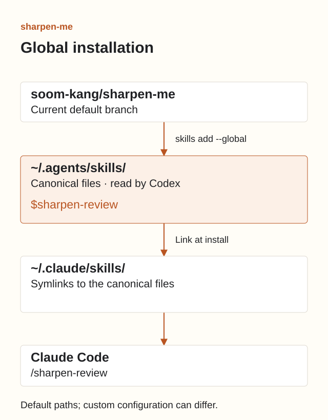
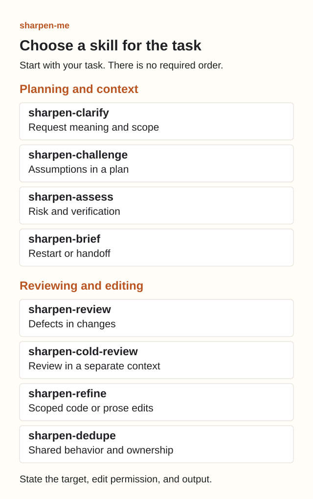

# Use sharpen-me

[한국어](usage.ko.md) · [Home](../README.md)

Choose a skill for the task and invoke it. The skills are independent choices, not a required sequence.

## 1. Install and check

Have Node.js 24.20.0 or later, npm/npx, Git, and the Codex or Claude Code app you use available. You do not need a repository checkout.

```bash
npx skills add soom-kang/sharpen-me --global --skill '*' --agent codex claude-code
npx skills list --global --agent codex claude-code
```

Confirm installation when prompted. You can decline the optional find-skills installation. Check that the list contains all eight sharpen-me skills. To install only one skill, run:

```bash
npx skills add soom-kang/sharpen-me --global \
  --skill sharpen-review --agent codex claude-code
```



The default symlink mode stores canonical files in `~/.agents/skills/` and links them from `~/.claude/skills/` for Claude Code. Codex uses the shared location. `CLAUDE_CONFIG_DIR` changes the Claude location. The CLI can fall back to copying if it cannot create a link.

## 2. Choose a skill



| Skill | Use it to |
| --- | --- |
| `sharpen-clarify` | Resolve competing readings of a request |
| `sharpen-challenge` | Test assumptions in a plan |
| `sharpen-assess` | Assess risk, capability, and verification |
| `sharpen-brief` | Restore context for a restart or handoff |
| `sharpen-review` | Find supported defects in changes |
| `sharpen-cold-review` | Review in a context separate from the author |
| `sharpen-refine` | Refine code or prose within an edit boundary |
| `sharpen-dedupe` | Decide what repeated code should share |

Use `sharpen-review` for ordinary change review and `sharpen-cold-review` when independence matters. Invoking `sharpen-cold-review` in the author conversation does not establish independence. It must report `not_run` if a separate context is unavailable.

## 3. Provide the task and its boundaries

Start with `$name` in Codex or `/name` in Claude Code. These are separate messages to the apps, not terminal commands.

```text
$sharpen-review Review the current diff for bugs. Do not edit files.
```

```text
/sharpen-review Review the current diff for bugs. Do not edit files.
```

Name the target, permitted edits, and desired output. Replace the example paths or commit with your own and send one request at a time. In Claude Code, replace the leading `$` with `/`.

<details>
<summary>Planning and handoff examples</summary>

```text
$sharpen-clarify Resolve the scope of the assignee filter from the API contract. Ask only about unresolved choices. Do not implement it.
$sharpen-challenge Examine the assumptions in docs/retry-plan.md. Propose a test that distinguishes support from rejection.
$sharpen-assess Assess the proposed migration's risk and verification needs. Recommend capability and reasoning effort. Do not execute it.
$sharpen-brief Summarize changes since known_commit, open decisions, and completed checks. Cite sources.
```

</details>

<details>
<summary>Review and editing examples</summary>

```text
$sharpen-cold-review Review docs/runbook.md for a new operator in a separate context. Report not_run if isolation is unavailable.
$sharpen-refine Simplify src/parser.ts without changing inputs, outputs, or errors. Only that file may change.
$sharpen-dedupe Compare src/import-a.ts and src/import-b.ts. Propose what to share or keep separate. Do not edit.
```

</details>

Selecting a skill grants no extra permission. You control model settings and edit permission. Automatic selection is available, but actual selection and source loading need execution evidence.

## 4. Update or remove

Save any local skill edits before refreshing or reinstalling. Reinstall the named skill from the current default branch to refresh it for Codex and Claude Code:

```bash
npx skills add soom-kang/sharpen-me --global \
  --skill sharpen-review --agent codex claude-code
```

Treat a failed source check as an unknown update state, even if the command exits successfully or later says all skills are up to date. This occurs in the pinned development CLI, skills 1.5.25, when both the remote check and its Git fallback fail. The explicit reinstall above reports a clone failure instead; restore access and retry it after preserving local edits. Other CLI versions may behave differently. See the [upstream error path](https://github.com/vercel-labs/skills/blob/7ffbeb96f012a63c0583a2e71e24385dc497566d/src/update.ts#L647-L683).

To refresh all eight, rerun the first installation command. The following removes only the eight named global skills. Agents sharing these global locations may also lose access to them. Separate project installations remain.

```bash
npx skills remove --global \
  sharpen-clarify sharpen-review sharpen-challenge sharpen-assess \
  sharpen-refine sharpen-cold-review sharpen-brief sharpen-dedupe
```

## 5. Resolve installation issues

| Symptom | Action |
| --- | --- |
| Skill is missing | Check the global list, then start a new agent session. |
| Agent reads older instructions | Check project `.agents/skills/` and `.claude/skills/` for duplicates; inspect the path actually read. |
| Install or update fails | Check Node, Git, network access, and the CLI error. Preserve local edits before reinstalling. |
| Cold review returns `not_run` | Provide the artifact and review purpose in a separate context without the author verdict. |

Successful installation does not establish model behavior quality. Read [Evaluation](evaluation.md) for results and limits.
